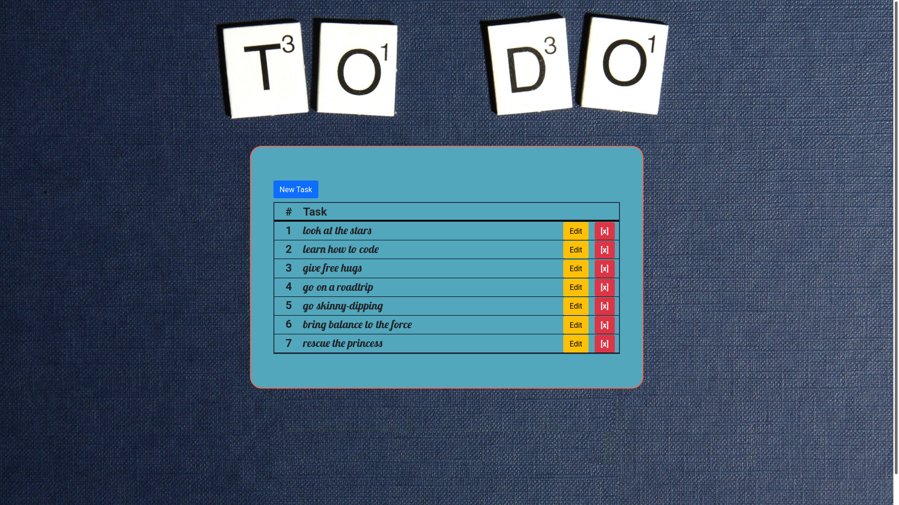
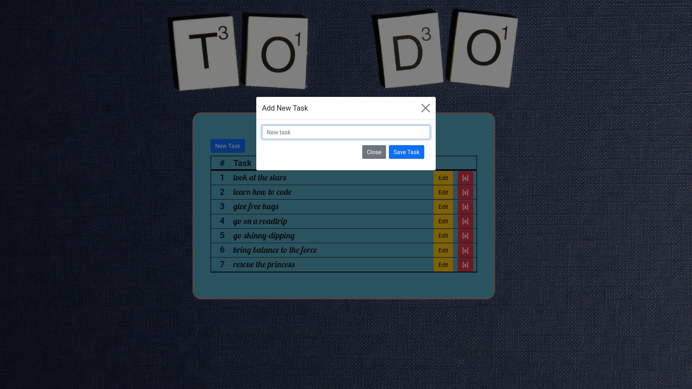
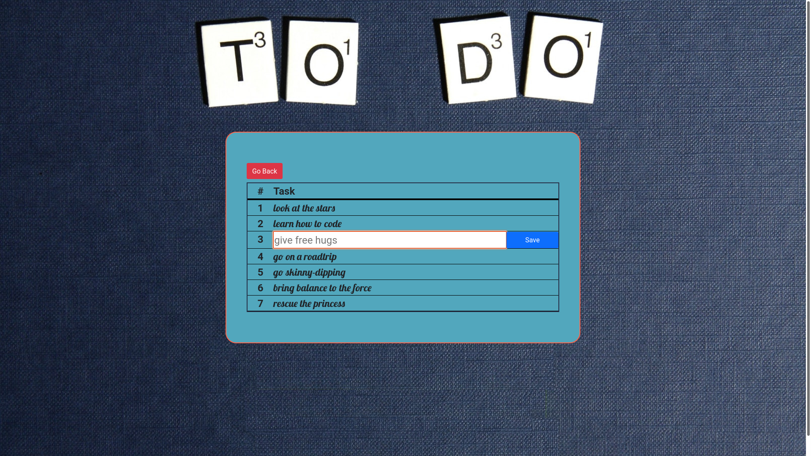

# Project: To-Do-List

I created a simple To-Do List for the purpose of learning Object Oriented PHP and CRUD operations on SQL Databases.

## The technologies I used for this project are:

- HTML
- Bootstrap
- CSS
- PHP
- MySQL
- PDO

## Functionality

At the startpage it shows you all tasks stored in the connected Database. By clicking the "New Task"-Button, a dialog appears, where you can enter a new task, hit "Save Task" and store it in the DB or "Close" the dialog without saving. When you click "Edit", you can edit the selected task and either "Save" or "Go Back". Clicking the red "[x]" deletes the task in the DB.

## Show all tasks in a list:

## Add a new task to the list:

## Edit a task:

